# Schéma Fonctionnel - DnD Hub

Ce diagramme représente le flux complet de l'application, de l'authentification à la gestion des sessions.

## Diagramme Mermaid

```mermaid
flowchart TD
    Start([🎲 Utilisateur D&D]) --> Auth{Authentification<br/>Better Auth}

    Auth -->|Nouvel utilisateur| Register["👤 Créer compte<br/>(Email + Mot de passe)"]
    Register --> Dashboard

    Auth -->|Utilisateur existant| Login["👤 Se connecter"]
    Login --> Dashboard["🖥️ Dashboard Multi-Campagnes<br/>(Toutes les campagnes)"]

    Dashboard --> ViewCampaigns["👤 Consulter Campagnes<br/>(Liste de mes campagnes)"]
    ViewCampaigns --> SelectCampaign["👤 Ouvrir Campagne"]
    SelectCampaign --> RoleDetection{Quel est ton rôle<br/>dans cette campagne?}

    %% CHEMIN MJ
    RoleDetection -->|Je suis MJ| MJSpace["🔐 Espace MJ Privé"]
    MJSpace --> MJMenu{Que veux-tu<br/>faire?}

    MJMenu -->|Nouvelle campagne| CreateCampaign["👤 Créer Campagne<br/>(Nom, Description, Univers)"]
    CreateCampaign --> AddPlayers["👤 Inviter Joueurs<br/>(Email ou code)"]
    AddPlayers --> SessionPrep["📝 Préparer Session<br/>(Notes, Plans MJ, Secrets)"]
    SessionPrep --> MJMenu

    MJMenu -->|Session existante| ManageSession["👤 Gérer Session"]
    ManageSession --> TranscribeChoice{Transcrire<br/>session audio?}

    TranscribeChoice -->|Oui| AudioUpload["🖥️ Uploader Transcription Audio<br/>(MP3/WAV)"]
    AudioUpload --> TranscribeAudio["🤖 IA Transcription Audio<br/>(Convertir MP3→Texte)"]
    TranscribeAudio --> Summarize

    TranscribeChoice -->|Non| ManualNotes["👤 Ajouter Notes Manuelles<br/>(Résumé MJ)"]
    ManualNotes --> Summarize

    Summarize["🤖 IA Génère Résumé Détaillé<br/>(Extraction événements clés,<br/>Contexte privé)"]
    Summarize --> EditSummary["👤 Éditer Résumé<br/>(Ajouter secrets MJ,<br/>Corriger détails)"]
    EditSummary --> FilterContent{Contenu à<br/>partager?}

    FilterContent -->|Préparer partage| ShareDecision["👤 Sélectionner contenu public<br/>(Retirer secrets MJ)"]
    ShareDecision --> PublishSession["🖥️ Publier Résumé Session<br/>(Visible joueurs)"]
    PublishSession --> NotifyPlayers["📧 Notifier Joueurs<br/>(Nouveau résumé disponible)"]

    FilterContent -->|Garder privé| PrivateStore["🖥️ Archiver en privé<br/>(Secrets MJ seulement)"]

    NotifyPlayers --> NextSession["👤 Planifier Prochaine Session<br/>(Date, Thème, Prérequis)"]
    PrivateStore --> NextSession
    NextSession --> MJMenu

    %% CHEMIN JOUEUR
    RoleDetection -->|Je suis Joueur| PlayerSpace["👁️ Espace Joueur<br/>(Campagne sélectionnée)"]
    PlayerSpace --> ViewSessions["📖 Voir Résumés Sessions<br/>(Contenu partagé par MJ)"]
    ViewSessions --> ReadSummary["👤 Lire Résumé de Session<br/>(Événements clés, contexte)"]
    ReadSummary --> PrepareRP["👤 Préparer Roleplay<br/>(Notes perso sur histoire)"]
    PrepareRP --> PlayerWait["⏳ En attente prochaine session"]
    PlayerWait --> PlayerSpace

    %% INTERACTIONS ENTRE RÔLES
    PublishSession -.->|Rend accessible| ViewSessions
    NextSession -.->|Informe| PlayerWait

    %% FIN
    PlayerWait --> End1([✅ Joueur prêt pour session])
    NextSession --> End2([✅ MJ prêt pour session])

    %% LÉGENDE
    subgraph Legend["📋 LÉGENDE - Types d'Acteurs"]
        A["🖥️ Systèmes Automatisés"]:::system
        B["🤖 Processus IA/ML"]:::ai
        C["👤 Actions Humaines"]:::human
        D["🎯 Objectifs/Résultats"]:::goal
    end

    classDef system fill:#4A90D9,color:#fff,stroke:#2E5C8A,stroke-width:2px
    classDef ai fill:#50C878,color:#fff,stroke:#2D7A52,stroke-width:2px
    classDef human fill:#FF9F43,color:#fff,stroke:#D97706,stroke-width:2px
    classDef goal fill:#E74C3C,color:#fff,stroke:#C0392B,stroke-width:2px
    classDef decision fill:#F39C12,color:#fff,stroke:#D68910,stroke-width:2px

    classDef process fill:#95A5A6,color:#fff,stroke:#7F8C8D,stroke-width:1px

    %% Application des styles
    class Auth,Dashboard,AudioUpload,PublishSession,NotifyPlayers,PrivateStore,ViewSessions system
    class TranscribeAudio,Summarize ai
    class Register,Login,CreateCampaign,AddPlayers,SessionPrep,ManageSession,ManualNotes,EditSummary,ShareDecision,NextSession,ViewCampaigns,SelectCampaign,ReadSummary,PrepareRP human
    class End1,End2 goal
    class RoleDetection,MJMenu,TranscribeChoice,FilterContent decision
```



---

## Légende des Acteurs

| Icône | Type     | Description                               |
| ----- | -------- | ----------------------------------------- |
| 🖥️    | Système  | Actions automatisées par l'application    |
| 🤖    | IA/ML    | Traitements par intelligence artificielle |
| 👤    | Humain   | Actions réalisées par l'utilisateur       |
| 🎯    | Objectif | Résultat final d'un parcours              |

---

## Décisions Clés Issues du Schéma

### ✅ Confirmé pour le MVP

1. **Authentification : Better Auth** avec Email/Password + Discord
2. **Deux espaces distincts** : MJ (privé) et Joueur (lecture)
3. **Système d'invitation** : par email ou code
4. **Transcription audio (IA)** : ✅ MVP
5. **Génération de résumé par IA** : ✅ MVP
6. **Publication contrôlée** : le MJ choisit ce qui est public
7. **Notes personnelles joueur** : ✅ MVP ("Préparer Roleplay")
8. **Calendrier des sessions** : ✅ MVP

### Reporté en V2

| Fonctionnalité               | Priorité |
| ---------------------------- | -------- |
| Notifications email          | V2       |
| OAuth Google/GitHub          | V2       |
| Historique des modifications | V2       |

---

## Flux MVP

```
Auth (Email/Discord) → Dashboard → Campagne →
  [MJ: CRUD Sessions + Transcription IA + Résumé IA]
  [Joueur: Lire Sessions publiées + Notes perso]
```
